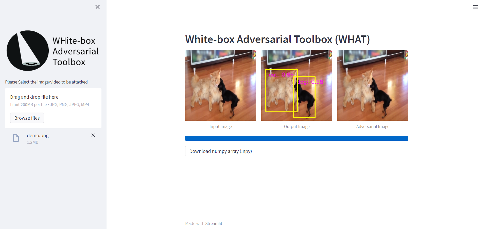

<a href="https://github.com/wuhanstudio/whitebox-adversarial-toolbox"></a>

# WHAT App

> Demo application for the White-box Adversarial Toolbox (BAT)

This app demonstrates how to attack the object detection system.

https://github.com/wuhanstudio/whitebox-adversarial-toolbox

## Quick Start

```
$ pip install streamlit whitebox-adversarial-toolbox numpy keras opencv-python tensorflow 
$ streamlit run streamlit_app.py
```


